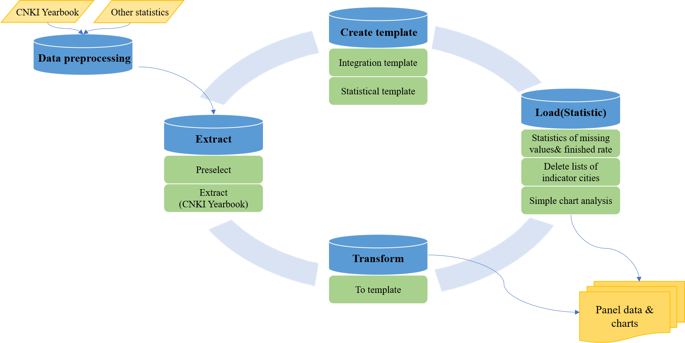
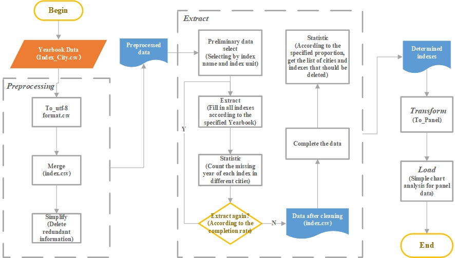

# StatPanel-ETL

Statistical Data Extraction, Transformation, and Loading Toolkit

## Overview

StatPanel-ETL is a statistical data ETL framework designed for city-level panel data construction, statistical yearbook processing, CNKI data collection, and research data preprocessing.

The toolkit supports a complete workflow from data collection and preprocessing to indicator extraction, quality assessment, missing-value handling, format transformation, and trend visualization. It is intended for economists, geographers, policy analysts, urban researchers, environmental researchers, and other users who need reproducible statistical panel datasets.

## Features

- Scenario-oriented statistical data extraction
- CNKI statistical indicator search and crawler workflow
- Batch CSV preprocessing and encoding conversion
- City-year-indicator model template generation
- Rule-based indicator extraction from sample data
- Data quality reports for missing values and supplement suggestions
- Manual supplement merging and missing-value interpolation
- Long/wide panel table transformation
- Trend chart visualization
- Export to Excel, CSV, PNG, and JPG

## Software Architecture



The project is organized into a core processing package and a graphical user interface. The core package provides reusable ETL functions and command-line commands. The GUI wraps these functions into task-oriented pages for regular users.



The main workflow is:

```text
Crawler / Raw CSV
    -> Preprocess
    -> Model
    -> Extract
    -> Quality
    -> Supplement
    -> Interpolation
    -> Transform
    -> Load / Trend Chart
```

## User Interface

The desktop GUI window title is `StatPanel ETL`. It provides the following functional pages:

- `Crawler`: search and collect statistical indicator data.
- `Preprocess`: convert encoding, standardize crawler samples, and merge files by indicator.
- `Model`: generate a city-year-indicator panel template.
- `Extract`: extract indicator values into the model template.
- `Quality`: generate data completeness and missing-value reports.
- `Supplement`: merge manually supplemented data.
- `Transform`: convert between long panel tables and wide year-column tables.
- `Interpolation`: fill missing values by city and indicator.
- `Load`: generate trend charts for quick inspection.

Example interface screenshots are stored in `screenshots/`:


Detailed GUI descriptions are available in:

- `docs/GUI_Description_EN.md`
- `docs/GUI_Description_CN.md`
- `screenshots/GUI_Description_EN.md`
- `screenshots/GUI_Description_CN.md`

The files under `screenshots/` keep image paths relative to the screenshot document location. The copies under `docs/` use `../screenshots/` paths so that they render correctly from the documentation directory.

## Installation

Install dependencies from the project root:

```bash
pip install -r requirements.txt
```

The main dependencies are:

- `pandas`: CSV/Excel reading, cleaning, merging, and transformation
- `openpyxl`: Excel report export
- `matplotlib`: trend chart generation
- `PyQt5`: graphical user interface
- `selenium`: browser automation for the crawler

For Windows users, a virtual environment is recommended:

```powershell
python -m venv .venv
.\.venv\Scripts\python.exe -m pip install -r requirements.txt
```

## Usage

### Launch the GUI

```bash
python src/gui/run_gui.py
```

On Windows, the batch launcher can also be used:

```powershell
src\gui\run_setl_gui.bat
```

### Run Core Commands

Run CLI commands from `src/core` so that the `setl_core` package is importable:

```bash
cd src/core
python -m setl_core.cli --help
```

Create a model template:

```bash
python -m setl_core.cli model --start-year 2000 --end-year 2020 --city-file ../../examples/templates/city_list_template.csv --output-file model.csv --index GDP
```

Convert raw CSV files to UTF-8:

```bash
python -m setl_core.cli convert-encoding --input-dir raw --output-dir utf8 --from-encoding gb18030
```

Standardize crawler sample columns:

```bash
python -m setl_core.cli standardize-sample --input-dir utf8 --output-dir standard
```

Merge files by indicator:

```bash
python -m setl_core.cli merge --input-dir standard --output-dir merged
```

Extract one indicator:

```bash
python -m setl_core.cli extract --model-file model.csv --sample-file merged/GDP.csv --output-file GDP_extract.csv --index GDP --source-mode any
```

Generate a quality report:

```bash
python -m setl_core.cli quality --input-file GDP_extract.csv --output-path quality_report.xlsx
```

Generate a trend chart:

```bash
python -m setl_core.cli trend --input-file GDP_extract.csv --output-file GDP_trend.png --variable GDP --group-column CityName
```

## Repository Structure

```text
StatPanel-ETL/
  README.md                         Project overview and usage entry point
  requirements.txt                  Root dependency list
  docs/                             Documentation and design materials
  screenshots/                      GUI screenshots and screenshot-local descriptions
  examples/                         Example inputs and templates
  src/                              Source code
    core/                           Core ETL package and core tests
    gui/                            PyQt5 graphical interface
  test/                             End-to-end and GUI smoke tests
```

Notes on related materials:

- `docs/Framework.png` and `docs/WorkFlow.jpg` are the current architecture and workflow images used by this README.
- `screenshots/*.png` are the actual GUI page screenshots used by the GUI description documents.
- `test/*_workspace/` contains test input and output artifacts. These files are useful as examples of expected output formats, but they are not required for normal use.

## Documentation

See the user guide:

```text
docs/UserGuide_EN.md
```

Additional interface description materials:

```text
docs/GUI_Description_EN.md
docs/GUI_Description_CN.md
screenshots/GUI_Description_EN.md
screenshots/GUI_Description_CN.md
```

## Testing

Run core unit tests:

```bash
cd src/core
python -m unittest discover -s tests
```

Run end-to-end and GUI smoke tests from the repository root:

```bash
python test/test_full_cli_flow.py
python test/test_gui_smoke.py
```

## License

MIT License
