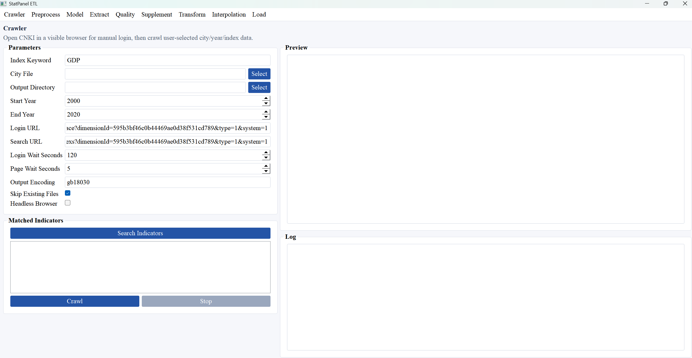
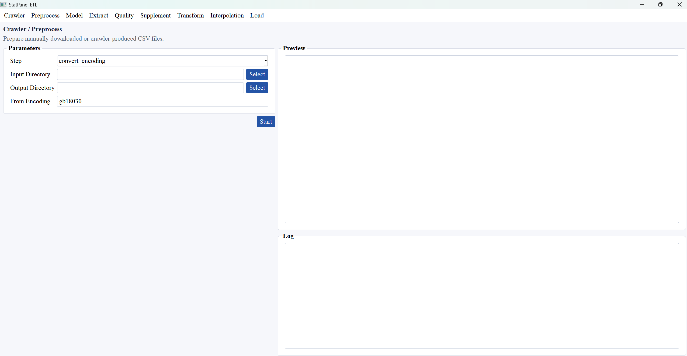
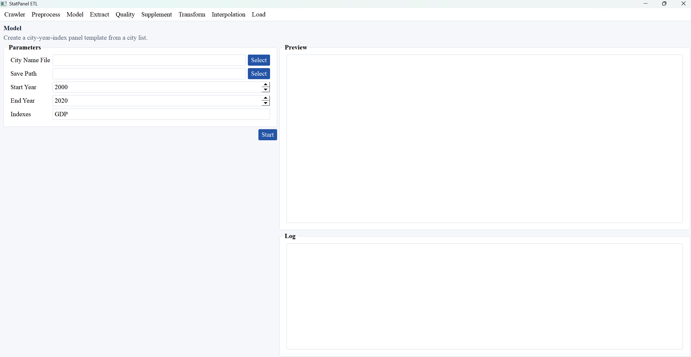
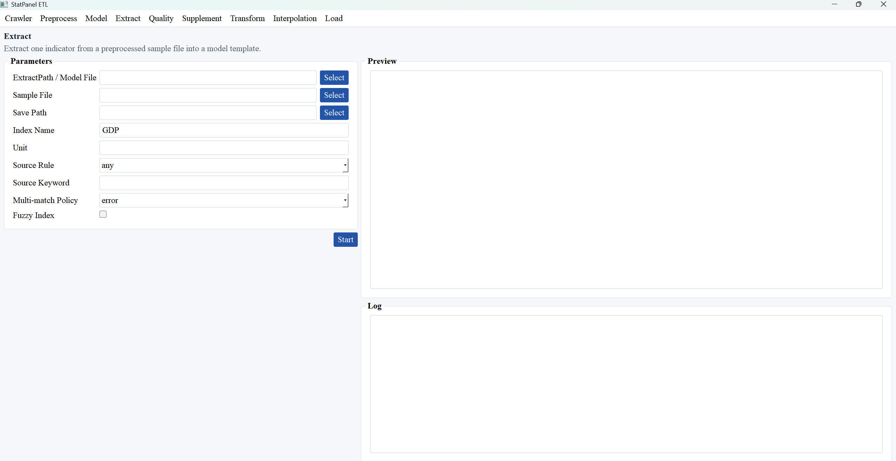
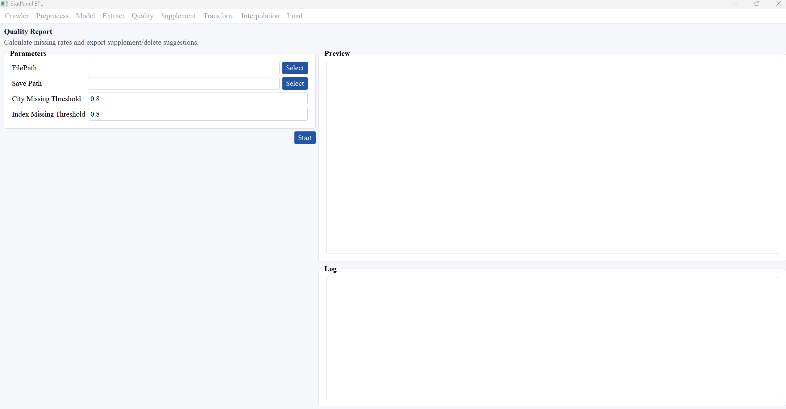
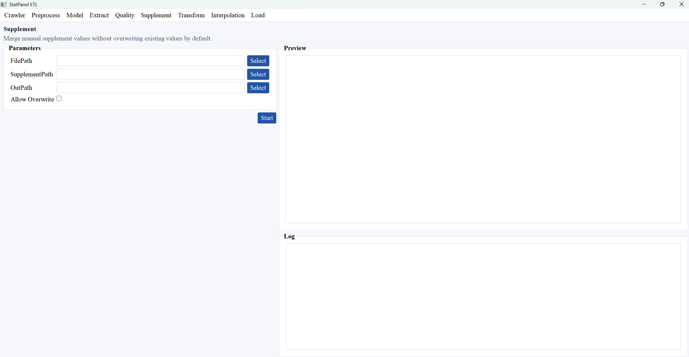
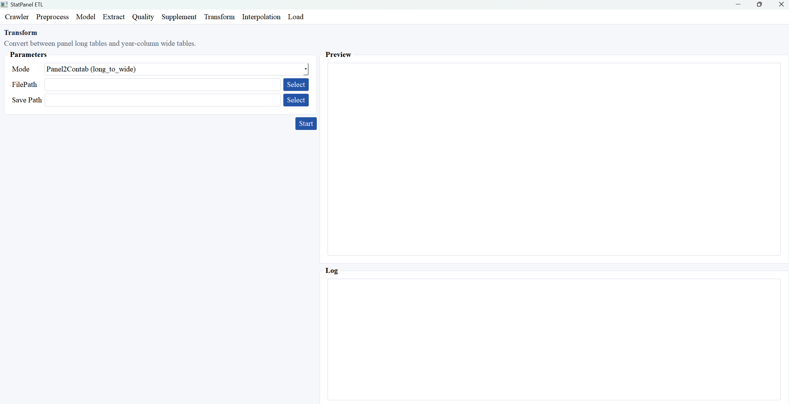
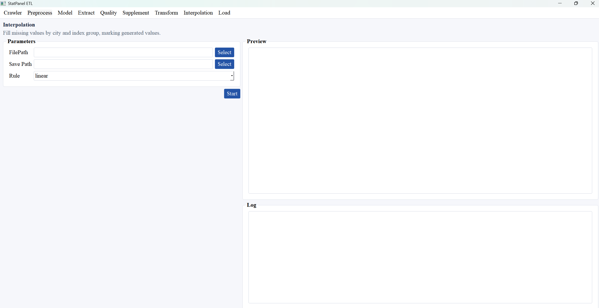
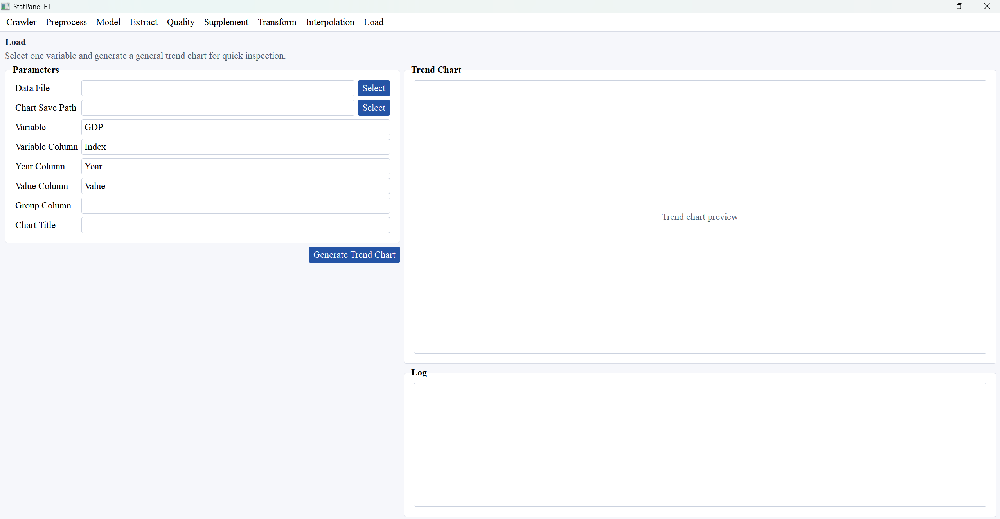

# StatPanel-ETL Statistical Data Extraction, Transformation, and Loading Software Interface Design Description (Software Copyright Version V1)

## 1. Overall Interface Description

The StatPanel-ETL statistical data extraction, transformation, and loading software uses a desktop graphical user interface. The main window title is `StatPanel ETL`, and the default window size is 1280 x 800. The system organizes all functions through the top menu bar. Users can switch among functional pages such as `Crawler`, `Preprocess`, `Model`, `Extract`, `Quality`, `Supplement`, `Transform`, `Interpolation`, and `Load`.

All functional pages use a unified layout. The left side is the parameter configuration area, where users select files, enter indicator names, set year ranges, or choose processing rules. The right side contains the result preview area and log area, which display data table previews, chart previews, and task execution details. In the interface, the `Select` button opens a file or directory selection window, the `Start` button or other function-specific execution buttons launch the current task, the `Preview` area displays processed data results, and the `Log` area records task status, error messages, and output paths.

This interface design is intended for statistical data organization, panel data construction, and research data preprocessing scenarios. It forms a complete workflow from data collection, data preprocessing, model template construction, indicator extraction, quality checking, missing-data supplementation, format transformation, and interpolation processing to trend chart generation.

## 2. Crawler Interface

The `Crawler` interface is used to search and collect specified city, year, and indicator data from statistical data sources such as CNKI. By combining manual login with automated search, this interface supports a workflow in which users first search for candidate indicators, then select the indicators to be collected, and finally run batch crawling.

### 2.1 Interface Elements

- `Index Keyword`: An input box for the indicator search keyword. It is used to enter the statistical indicator name or keyword to be searched, such as `GDP`.
- `City File`: An input box for the city list file path. It specifies the file containing city names or city codes.
- `Output Directory`: An input box for the output directory. It sets the save location for crawled data files.
- `Start Year`: An input box for the starting year of data collection.
- `End Year`: An input box for the ending year of data collection.
- `Login URL`: An input box for the login address. It configures the entry URL for user login or data platform access.
- `Search URL`: An input box for the search address. It configures the statistical data search page URL.
- `Login Wait Seconds`: An input box for login waiting time. It reserves time for manual login, captcha verification, or institutional access authentication.
- `Page Wait Seconds`: An input box for page waiting time. It controls the wait duration for page loading and data reading.
- `Output Encoding`: An input box for output encoding. It sets the character encoding of exported CSV files.
- `Skip Existing Files`: A checkbox for skipping existing files. When selected, the system does not collect data again if the target file already exists.
- `Headless Browser`: A checkbox for headless browser mode. It controls whether the browser runs without a visible interface.
- `Search Indicators` button: Searches candidate indicators based on the keyword.
- `Matched Indicators` list: Displays the candidate indicators found by the search. Users can select the specific indicators to collect.
- `Crawl` button: Starts the data collection task for the selected indicators.
- `Stop` button: Requests the current collection task to stop. The system stops after finishing the current city or indicator.
- `Preview` table: Displays the first several rows of collected or saved CSV files.
- `Log` text box: Records login prompts, search results, collection progress, failed items, and output file paths.

### 2.2 Implemented Functions

This interface implements statistical indicator search, candidate indicator selection, batch collection of city-year data, breakpoint skipping, collection process logging, and result preview. After users enter keywords, a city file, and a year range, they first use `Search Indicators` to obtain candidate indicators, then select indicators and click `Crawl` to run data collection. The system generates corresponding data files based on city, year, and indicator, and displays collection results in the preview area on the right.

## 3. Preprocess Interface

The `Preprocess` interface is used to preprocess original CSV files downloaded manually or generated by the crawler, so that they meet the input requirements for subsequent extraction, quality checking, and panel data construction.

### 3.1 Interface Elements

- `Step`: A preprocessing step selector that provides processing methods such as `convert_encoding`, `standardize_sample`, and `merge_by_indicator`.
- `Input Directory`: An input box for the input directory path. It specifies the directory containing original data files to be processed.
- `Output Directory`: An input box for the output directory path. It specifies where preprocessing results are saved.
- `From Encoding`: An input box for original file encoding. It specifies the encoding of source CSV files, such as `gb18030`.
- `Select` button: Selects the input directory or output directory.
- `Start` button: Executes the currently selected preprocessing step.
- `Preview` table: Displays previewable data file content from the output directory.
- `Log` text box: Displays preprocessing steps, file reading status, and output results.

### 3.2 Implemented Functions

This interface implements preprocessing functions including encoding conversion, sample standardization, and merging by indicator. `convert_encoding` converts original files to a unified encoding, `standardize_sample` organizes sample field formats, and `merge_by_indicator` merges data of the same indicator type into a unified file. The preprocessed data can be used as sample data input for the `Extract` interface.

## 4. Model Interface

The `Model` interface is used to generate a data template with a three-dimensional structure of city, year, and indicator, providing a base table for subsequent indicator extraction and panel data construction.

### 4.1 Interface Elements

- `City Name File`: An input box for the city name file path. It specifies the city list file.
- `Save Path`: An input box for the template save path. It sets the output location of the generated model file.
- `Start Year`: An input box for the starting year of the template.
- `End Year`: An input box for the ending year of the template.
- `Indexes`: An input box for indicator names. Multiple indicators can be separated by commas.
- `Select` button: Selects the city file or output file path.
- `Start` button: Generates the model template.
- `Preview` table: Displays the generated model table content.
- `Log` text box: Displays template generation status and the output file path.

### 4.2 Implemented Functions

This interface automatically generates a panel data template based on the city list, year range, and indicator names. The template usually contains city, year, indicator, and pending value fields, and serves as the model file used by the `Extract` interface during indicator extraction. This design ensures that different indicators are organized under unified city and year dimensions, making later quality checking and transformation easier.

## 5. Extract Interface

The `Extract` interface is used to extract preprocessed sample data into the model template according to specified indicator, unit, and source rules, forming a structured indicator result table.

### 5.1 Interface Elements

- `ExtractPath / Model File`: An input box for the model file path. It selects the template file generated by the `Model` interface.
- `Sample File`: An input box for the sample data path. It selects the preprocessed statistical data file.
- `Save Path`: An input box for the result save path. It specifies the output location of the extraction result file.
- `Index Name`: An input box for the indicator name to be extracted.
- `Unit`: An input box for the unit. It restricts the measurement unit of the data to be matched.
- `Source Rule`: A selector for source matching rules, including rules such as `any`, `exact`, `contains`, and `city_contains`.
- `Source Keyword`: An input box for source keywords. It further filters data by data source, city, or description fields.
- `Multi-match Policy`: A selector for multi-match handling policies, including `error`, `first`, `last`, and `non_null_first`.
- `Fuzzy Index`: A checkbox for fuzzy indicator matching. When selected, fuzzy matching is allowed for indicator names.
- `Select` button: Selects the model file, sample file, and output path.
- `Start` button: Executes indicator extraction.
- `Preview` table: Displays the result table after extraction is complete.
- `Log` text box: Displays the extraction process, matching status, and output results.

### 5.2 Implemented Functions

This interface implements rule-based extraction of statistical indicator data. After users select the model file and sample file, the system locates target data according to the indicator name, unit, source rule, and multi-match policy, then writes the result into the model template. This function is used to organize unstructured or semi-structured sample data into a unified panel format.

## 6. Quality Interface

The `Quality` interface is used to check the data quality of extraction results, calculate missingness by city and indicator dimensions, and export quality reports.

### 6.1 Interface Elements

- `FilePath`: An input box for the input file path. It selects the data result file to be checked.
- `Save Path`: An input box for the quality report save path. It specifies the exported quality report file.
- `City Missing Threshold`: An input box for the city missingness threshold. It determines whether city-level missing data exceed the configured ratio.
- `Index Missing Threshold`: An input box for the indicator missingness threshold. It determines whether indicator-level missing data exceed the configured ratio.
- `Select` button: Selects the input file and report output path.
- `Start` button: Generates the quality report.
- `Preview` table: Displays the quality report or related result file preview.
- `Log` text box: Displays missing-rate calculation and report export status.

### 6.2 Implemented Functions

This interface implements missing-rate statistics, abnormal data prompts, supplementation suggestions, and deletion suggestion output. The system calculates the data completeness of cities and indicators based on user-defined thresholds and exports an Excel quality report, providing a basis for later `Supplement` data supplementation and `Interpolation` processing.

## 7. Supplement Interface

The `Supplement` interface is used to merge manually supplemented data into extraction results, handling missing data found after quality checking.

### 7.1 Interface Elements

- `FilePath`: An input box for the extraction result file path. It selects the data file that needs supplementation.
- `SupplementPath`: An input box for the supplement data file path. It selects the manually organized supplement value file.
- `OutPath`: An input box for the output path. It specifies where the supplemented data file is saved.
- `Allow Overwrite`: A checkbox for allowing overwrite. When selected, supplement values can overwrite existing non-empty values. When not selected, existing data are not overwritten by default.
- `Select` button: Selects the input file, supplement file, and output path.
- `Start` button: Executes data supplementation.
- `Preview` table: Displays the data table after supplementation is complete.
- `Log` text box: Displays the supplement merge process and output results.

### 7.2 Implemented Functions

This interface implements merging of manually supplemented values. The system writes data from the supplement file into the extraction result according to key fields such as city, year, and indicator, and uses `Allow Overwrite` to control whether existing values are overwritten. This function is suitable for manually correcting and completing missing items identified in the quality report.

## 8. Transform Interface

The `Transform` interface is used to convert between panel long tables and year-column wide tables, meeting the data structure requirements of different analysis software or data processing workflows.

### 8.1 Interface Elements

- `Mode`: A transformation mode selector, including `Panel2Contab (long_to_wide)` and `Contab2Panel (wide_to_long)`.
- `FilePath`: An input box for the input file path. It selects the data file to be transformed.
- `Save Path`: An input box for the output file path. It specifies where the transformation result is saved.
- `Select` button: Selects the input file and output file path.
- `Start` button: Executes format transformation.
- `Preview` table: Displays the data table after transformation is complete.
- `Log` text box: Displays the transformation mode, processing status, and output path.

### 8.2 Implemented Functions

This interface implements conversion between two table structures. `Panel2Contab` converts long-table data containing city, year, and indicator fields into a wide table expanded by year columns. `Contab2Panel` converts a wide table back into a panel long table. This function supports data format switching among Excel inspection, statistical software modeling, and subsequent data analysis.

## 9. Interpolation Interface

The `Interpolation` interface is used to automatically fill missing values in data and mark interpolation results generated by the system.

### 9.1 Interface Elements

- `FilePath`: An input box for the input file path. It selects the data file requiring interpolation.
- `Save Path`: An input box for the output file path. It specifies where interpolation results are saved.
- `Rule`: An interpolation rule selector, including methods such as `linear`, `ffill`, `bfill`, and `growth`.
- `Select` button: Selects the input file and output file path.
- `Start` button: Executes interpolation processing.
- `Preview` table: Displays data results after interpolation processing.
- `Log` text box: Displays the interpolation method, processing progress, and output path.

### 9.2 Implemented Functions

This interface fills missing values by grouping data by city and indicator. `linear` indicates linear interpolation, `ffill` indicates forward filling with previous values, `bfill` indicates backward filling with later values, and `growth` indicates completion based on growth trends. When generating results, the system retains interpolation marks so that users can distinguish original data from system-generated data.

## 10. Load Interface

The `Load` interface is used to select specified variables from organized data files and generate trend charts, helping users quickly inspect data results and produce visualization outputs.

### 10.1 Interface Elements

- `Data File`: An input box for the data file path. It selects the data file to be plotted.
- `Chart Save Path`: An input box for the chart save path. It specifies the save location of the generated image file.
- `Variable`: An input box for the variable name. It enters the indicator or variable name to be plotted.
- `Variable Column`: An input box for the variable column name. It specifies the column that stores variable names in the data table. The default value is `Index`.
- `Year Column`: An input box for the year column name. It specifies the column that stores years in the data table. The default value is `Year`.
- `Value Column`: An input box for the value column name. It specifies the column that stores values in the data table. The default value is `Value`.
- `Group Column`: An input box for the group column name. It specifies a grouping field, such as city name. When empty, the chart is generated using the overall data.
- `Chart Title`: An input box for the chart title. It sets the title of the output trend chart.
- `Generate Trend Chart` button: Generates the trend chart.
- `Trend Chart` preview area: Displays the generated trend chart image.
- `Log` text box: Displays the charting process and chart output path.

### 10.2 Implemented Functions

This interface implements statistical variable trend chart generation and visualization preview. After users select a data file and configure the variable name, year column, value column, and optional group column, the system generates a trend chart and saves it as a PNG or JPG image. This function is used to inspect data change trends, verify organized results, and output auxiliary charts for papers or reports.

## 11. Interface Interaction and Runtime Mechanism

All system pages use a unified task execution mechanism. After users configure parameters and click the execution button, the system runs the corresponding data processing function in a background thread, preventing the interface from becoming unresponsive during task execution. After the task is complete, the system uses a message box to notify the user of the output location and displays results in the preview area. If a task fails, the system displays error information in the log area and opens an error prompt window.

The file selection function is implemented through standard file selection dialogs. Input files support common data formats such as CSV and Excel, and output files can be saved as CSV, Excel, or image files. The preview function reads the first several rows of processing results and displays them in a table, allowing users to quickly check whether fields, years, indicators, and values are correct.

## 12. Interface File List

| No. | Interface Screenshot File | Corresponding Functional Interface |
| --- | --- | --- |
| 1 | `../screenshots/Crawler.png` | Data collection interface |
| 2 | `../screenshots/Preprocess.png` | Data preprocessing interface |
| 3 | `../screenshots/Model.png` | Model template generation interface |
| 4 | `../screenshots/Extract.png` | Indicator extraction interface |
| 5 | `../screenshots/Quality.png` | Data quality checking interface |
| 6 | `../screenshots/Supplement.png` | Missing data supplementation interface |
| 7 | `../screenshots/Transform.png` | Data format transformation interface |
| 8 | `../screenshots/Interpolation.png` | Missing value interpolation interface |
| 9 | `../screenshots/Load.png` | Trend chart generation interface |

## 13. Design Features

The StatPanel-ETL software interface is organized around the statistical data ETL workflow. It divides complex operations such as data collection, organization, extraction, supplementation, transformation, and visualization into multiple functional pages. Each page maintains consistent input controls, selection buttons, execution buttons, preview windows, and log windows, reducing the user's learning cost. The interface design balances manual confirmation with automated processing: users can manually configure file paths, indicator rules, and thresholds, while the system automatically completes batch processing and result output.

This interface design reflects the business workflow, data structure, and interaction logic of the software in the field of statistical data organization. It can provide supporting materials for interface descriptions, function descriptions, and operation instructions in software copyright registration.
